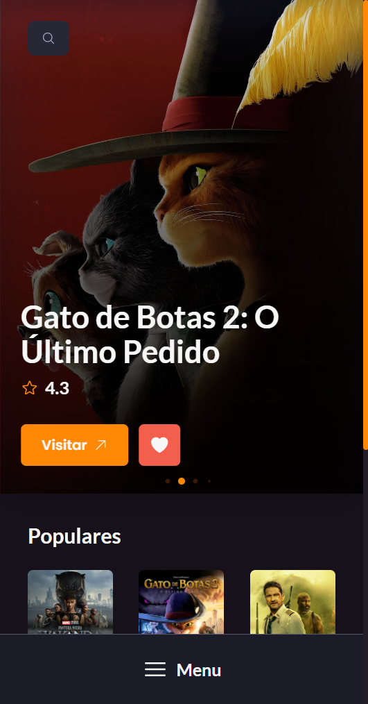

# Movieshelf


## :movie_camera: **Projeto**

> Uma estante de filmes, para o seu "eu cinéfilo".

A Movieshelf é uma estante virtual de filmes, na qual você pode adicionar os filmes à sua estante, favoritar os queridinhos e salvar filmes para sua próxima sessão de filme.

<p align="center">
   <a href="https://movieshelf-two.vercel.app">Veja o projeto completo aqui.</a>
</p>

## :art: **Visual do Projeto**

### _Desktop e Telas Maiores_

<h1 align="center">
    
</h1>

### _Mobile e Telas Menores_

<h1 align="center">
    
</h1>

## :wrench: **Tecnologias**

### :hammer: **Construção do site**

- [TypeScript](https://www.typescriptlang.org)
- [React](https://pt-br.reactjs.org)
- [The Movie Database API](https://developers.themoviedb.org/3)
- [Tanstack Query](https://tanstack.com/query/latest)
- [Vite](https://vitejs.dev/)

### :art: **Estilização**

- [Tailwind CSS](https://tailwindcss.com)
- [Phosphor Icons](https://phosphoricons.com)
- [Radix UI](https://www.radix-ui.com)
- [React Loading Skeleton](https://www.npmjs.com/package/react-loading-skeleton)
- [Swiper](https://swiperjs.com)
- [Google Fonts](https://fonts.google.com)

### :open_file_folder: **IDE, Versionamento e Deploy**

- [Visual Studio Code](https://code.visualstudio.com)
- [Git](https://git-scm.com)
- [GitHub](https://github.com)
- [Vercel](https://vercel.com/)

## :rocket: **Configurações e Instalação**

### Requisitos
- [Node e NPM](https://nodejs.org/)

Recomendo que veja a [documentação de configuração do Vite](https://vitejs.dev/config/). 

```sh
# Clonando o projeto
git clone https://github.com/davsilvam/movieshelf.git

# Instalando as dependências
npm install

# Criar arquivo .env com base no .env.example e preencher o campo com sua chave da API
VITE_API_KEY="<sua_chave>"

# Compilar e abrir o programa para desenvolvimento
npm run dev

# Compilar e minificar para produção
npm run build
```

## :balance_scale: **Licença**

Esse projeto está sob a [licença MIT](https://github.com/davsilvam/movieshelf/blob/main/LICENSE.md).

<p align="center">
  Feito com :purple_heart: por <a href="https://www.linkedin.com/in/davsilvam/">David Silva</a>.
</p>

---
