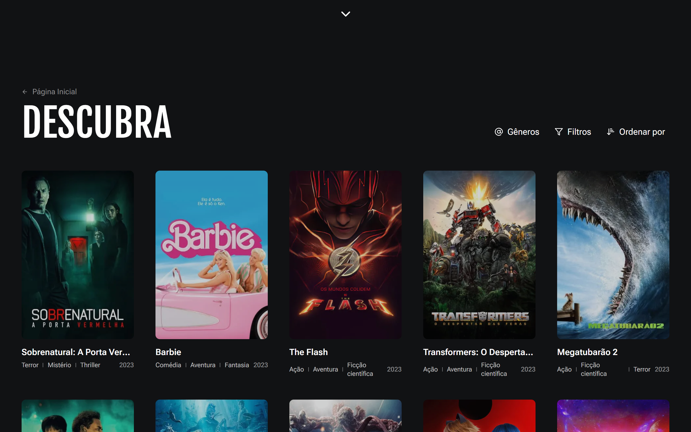
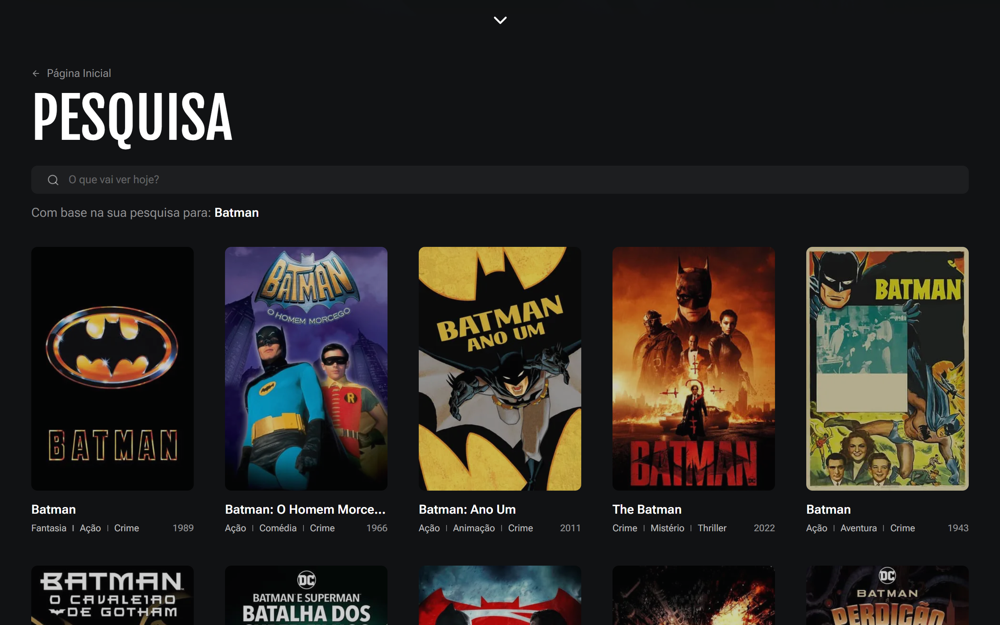
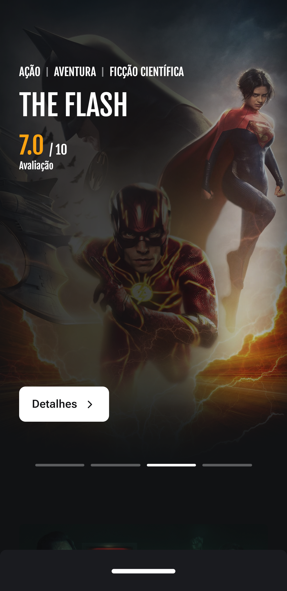
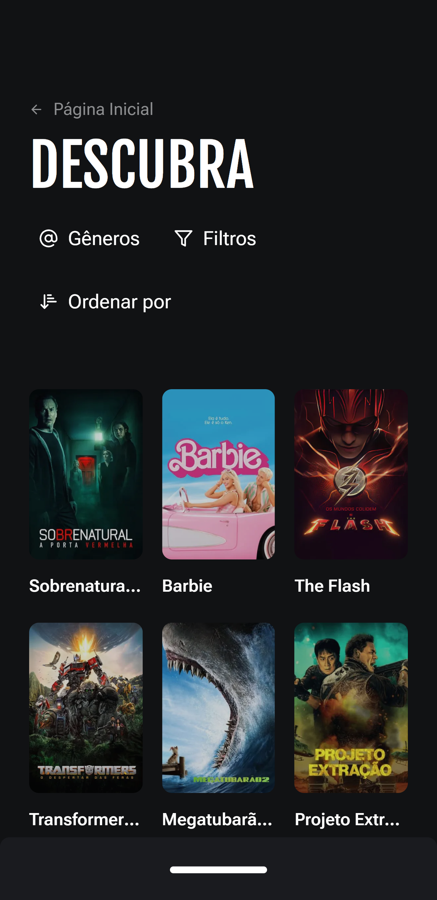
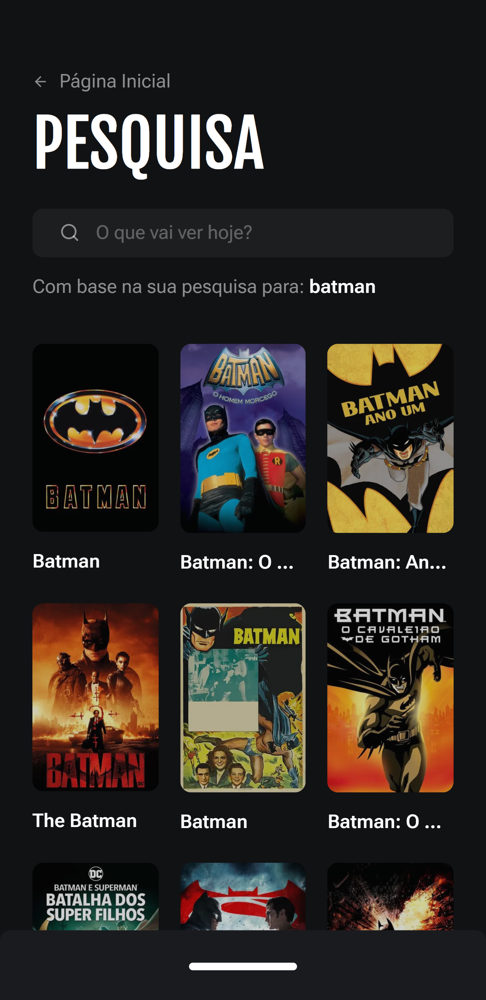

# Movieshelf


## :bookmark: **Sumário**
- [Sobre o Projeto](#film_strip-sobre-o-projeto)
- [Visual do Projeto](#art-visual-do-projeto)
   - [Desktop e Telas Maiores](#desktop-e-telas-maiores)
   - [Mobile e Telas Menores](#mobile-e-telas-menores)
- [Tecnologias](#wrench-tecnologias)
   - [Construção do site](#construção-do-site)
   - [Estilização](#estilização)
   - [IDE, Versionamento e Deploy](#ide-versionamento-e-deploy)
- [Configurações e Instalação](#rocket-configurações-e-instalação)
     - [Requisitos](#requisitos)
- [Licença](#balance_scale-licença)

## :film_strip: **Sobre o Projeto**

A Movieshelf (trocadilho com *movie*: filme, e *shelf*: estante) é uma aplicação que mostra filmes das mais variadas categorias e suas informações, contando com o catálogo do [TMDB](https://www.themoviedb.org/?language=pt-BR).

<p align="center">
   <a href="https://themovieshelf.vercel.app">Veja o projeto completo aqui.</a>
</p>

## :art: **Visual do Projeto**

### _Desktop e Telas Maiores_

<h1 align="center">
    
</h1>

<h1 align="center">
    
</h1>

<h1 align="center">
    
</h1>

### _Mobile e Telas Menores_

<h1 align="center">
    
</h1>

<h1 align="center">
    
</h1>

<h1 align="center">
    
</h1>

## :wrench: **Tecnologias**

Tecnologias utilizadas no projeto.

### **Construção do site**

- [TypeScript](https://www.typescriptlang.org)
- [Next 13 (App Router)](https://vuejs.org)
- [The Movie Database API](https://developer.themoviedb.org/docs)
- [TanStack Query](https://tanstack.com/query/latest)
- [React Hook Form](https://www.react-hook-form.com)
- [Zod](https://zod.dev)
- [Swiper](https://swiperjs.com)
- [Radix UI](https://www.radix-ui.com)

### **Estilização**

- [Tailwind CSS](https://tailwindcss.com)
- [clsx](https://github.com/lukeed/clsx)
- [tailwind-merge](https://github.com/dcastil/tailwind-merge)
- [Lucide Icons](https://lucide.dev)

### **IDE, Versionamento e Deploy**

- [Visual Studio Code](https://code.visualstudio.com)
- [Git](https://git-scm.com)
- [GitHub](https://github.com)
- [Vercel](https://vercel.com/)

## :rocket: **Configurações e Instalação**

### Requisitos

- [Node](https://nodejs.org/) e um gerenciador de pacotes, usei [pnpm](https://pnpm.io/pt/).

```sh
# Caso não tenha o pnpm, execute:
npm install -g pnpm
```

Recomendo que veja a [documentação de configuração do Next](https://nextjs.org/docs/getting-started/installation).

```sh
# Clonando o projeto
git clone https://github.com/davsilvam/movieshelf.git

# Instalando as dependências
pnpm install

# Criar arquivo .env.local com base no .env.example e preencher o campo com seu Token de Acesso
NEXT_PUBLIC_TMDB_ACCESS_TOKEN="<seu-token>"

# Compilar e abrir o programa para desenvolvimento
pnpm dev

# Compilar e minificar para produção
pnpm build
```

## :balance_scale: **Licença**

Esse projeto está sob a [licença MIT](https://github.com/davsilvam/movieshelf/blob/main/LICENSE.md).

---

Feito com 💛 e ☕ por <a href="https://www.linkedin.com/in/davsilvam/">David Silva</a>.

> [Portfólio](https://davidsilvam.vercel.app) &nbsp;&middot;&nbsp;
> GitHub [@davsilvam](https://github.com/davsilvam) &nbsp;&middot;&nbsp;
> Instagram [@davsilvam_](https://www.instagram.com/davsilvam_/)
